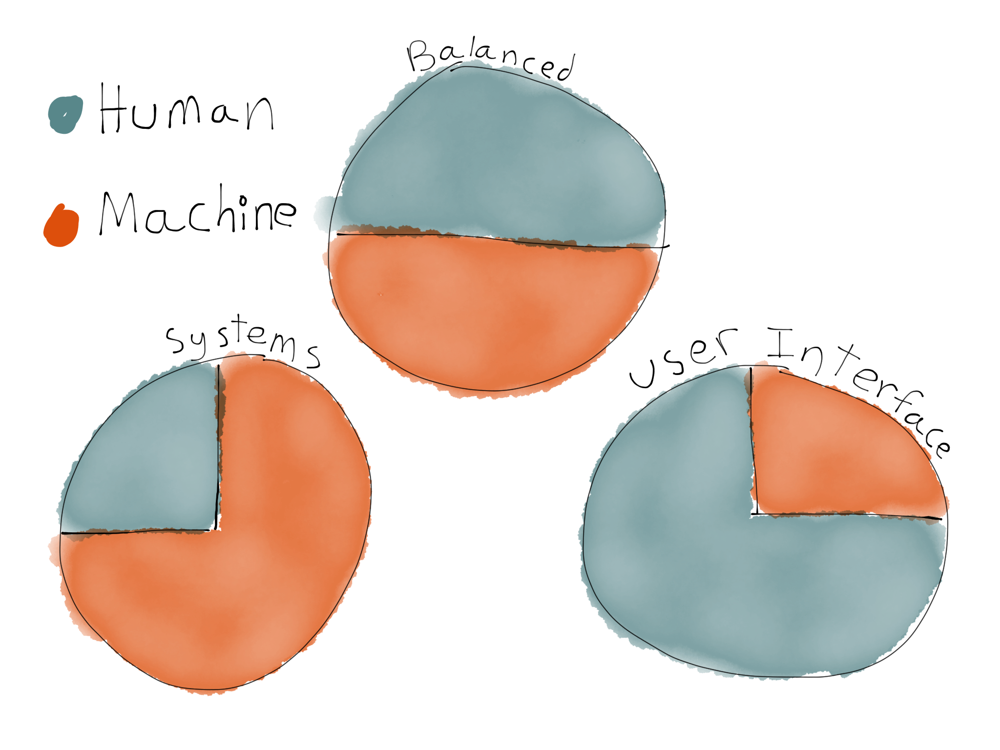
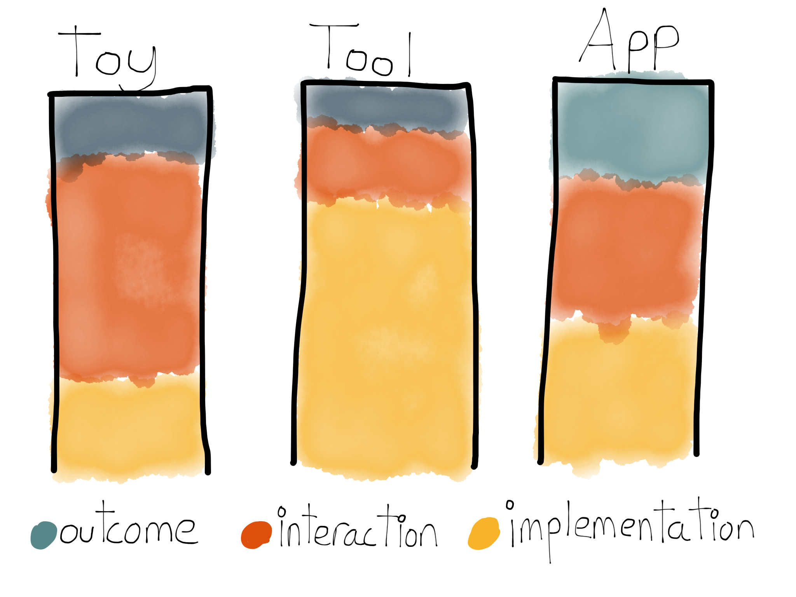

"Computer programming is magic!" they say. "Programmers are wizards or
sorceresses floating in a darkened room, cackling while muttering incantations,
and weaving spells that power automobiles, facebook, medical devices, and even
airplanes!"

This is a myth. Computer programming is patiently guiding a very stubborn, very
pedantic small child with limited vocabulary and life experience through a
problem you barely understand.

This guidance is done by providing instructions to the computer using a
programming language. Programming languages are human-friendly enough to be
reasoned about as a person, while being rigid enough to be interpreted and
followed by a computer. This set of instructions is called a program.

All programs have three parts:

* Outcomes - How a programs user is different because they use the program.
* Interactions - How users work with the program.
* Implementations - The internal structure of the program.

**Good programmers implement programs that encourage the interactions that
generate the users desired outcomes.**

### How Can I Be a Good Programmer?

**Good programmers have empathy**. They shift their mental state into the
machine that runs the program or into the people who use the program. They use
this empathy to figure out what they want the program to do as well as how to do
it. They then communicate this to the machine with code.

Empathizing with the computer is a difficult task.  Novice programmers must
learn to build a solid understanding of how, what, and why the machine works
without falling into a rabbit hole of incomprehensible detail.

** Good programmers know their level of understanding**. I, personally, use 4
levels to organize the topics and skills I have:

* Completely Unkown - I may have heard of or read a book on this, but have zero
  professional or personal experience with. I need assistance and guidance in
  order to accomplish things in these skill areas or topics.  Pottery, visual
  design, the C programming language, and machine learning go here for me.
* Somewhat Unknown - I have a little bit of experience with this, or it has been
  a while. I spend a quite a bit of time in documentation when working with
  these skills or topics. PHP, Wordpress, user research, violin, or operations
  engineering are all things that are somewhat unknown to me.
* Somewhat Known - I have a reasonable amount of experience with this. I spend a
  little bit of time in the documentation, but most of the time working
  productively. Clojure, HTML, and CSS all fit in this category.
* Very Known - Productivity flow. I reference documentation infrequently. I make
  intuitive connections. Ruby and JavaScript web development fits squarely in
  this realm for me.

It's OK to leave skills or topics Completely Unknown. We can rely on practice,
experience, working with others, etc. to groww concepts and skills from
Completely Unknown to Somewhat Known over time. When a new topic or skill
becomes both important and urgent, we can focus on that for a period of time to
move it into Somewhat Known.

### What Should I Focus On?

The primary way to distinguish what kind of programmers you are is whether you
understand people or machines:

* Systems Programmers - Primarily empathize with machines. They build systems
  that respond quickly to user input and stay up even when there are many users.
  These are the people who ensure Google can search billions of web pages in
  milliseconds. Sometimes called "Back end" programmers.

* User Interface Programmers - Empathise mostly with users. They build
  interfaces to assist users in accomplishing their goals. These people work
  closely with designers and introduce ideas like [Google instant
  search](http://www.google.com/insidesearch/features/instant/about.html).

* Balanced Programmers - Empathize with both users and machines. They are
  versatile, yet rare. It may take longer for skills to develop because of a
  lack of focus.

If you are motivated by making things for people to see and use you may want to focus on
being a user interface programmer.

If you are moticated primarily by knowledge and deep understanding of computers,
and prefer admiration from your peers over the admiration of the public, consider systems programming.

If you are unsure, consider balancing your focus between systems and user
interfaces. You may discover you enjoy one over the other and will naturally
gravitate in that direction.

### What Kinds of Programs Are There?

If we use the outcomes/interactions/implementations framework, we may start to
categorize programs based upon what they focus on:

* Application - An equal mix of outcome, interaction, and implementation focus.
  Examples: [eBay](http://www.ebay.com), [Uber](https://www.uber.com), [Google
  Search](https://www.google.com), [Simple](https://www.simple.com), etc.
* Toys - Primarily focused on interaction. Examples:
  [Netflix](http://www.netflix.com/), [Threes](http://asherv.com/threes/), etc.
* Tools - Primarily focused on implementation. Examples: [Flight Control
  Systems](http://en.wikipedia.org/wiki/Flight_management_system), [Engine
  Control Units](http://en.wikipedia.org/wiki/Engine_control_unit), Etc.

This guide focuses primarily on applications that are delivered over the web.

### Recommended Next Steps
* If you're ready to jump into web applications, I recommend [grokking web
  applications](grokking-web-applications.html)
